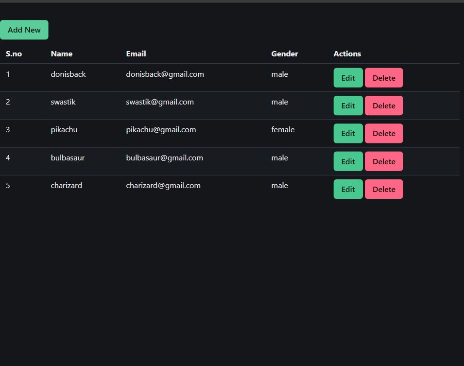

This is a project where i build the backend and frontend and connect them to each other,
this basic application explain how to make a small list of users using the frontend and backend.

frontend{
    react js,
    axios,
    react-router,
    react-router-dom,
    bulma for style
}

backend {
    node js,
    express js,
    mongoose,
    mongoDB,
    cors,
    dotenv,
}

This is your home page where you get all the list of users you add!

This is your add user page where you can add new user by adding the details like name, email, and gender!

This is your edit page where you can update the exisiting user and can assign new value to them

